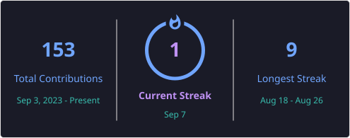

# Hi 👋, I'm Prashant Kharkwal

  

  

- 🔭 I'm currently working on **A SpringBoot project.**

- 🌱 I'm currently learning **Java SpringBoot.**

- 🤝 I'm looking for help with **learning System Design.**

- 💬 Ask me about **DSA, System Design and web development.**

- 📫 How to reach me **prashantkharkwal@gmail.com**

- ⚡ Fun fact **Aside from Programming I love to Play Cricket. 🏏**

- 📄 Know about my experiences **[https://docs.google.com/document/d/1o0zwzDG2_6NS9ubhXJtkj0lj1etvOcaOsY7mof2alFQ/edit?usp=sharing](https://docs.google.com/document/d/1o0zwzDG2_6NS9ubhXJtkj0lj1etvOcaOsY7mof2alFQ/edit?usp=sharing)**

<h3 align="left">Connect with me:</h3>

<h3 align="left">Languages and Tools:</h3>

            

  

